# ☁️ Azure Data Pipeline — Cloud ETL with Azure Data Factory

<p align="center">
  
  
  
  
</p>

> **Internship:** Celebal Technologies Excellence Internship Program  
> **Domain:** Data Engineering  
> **Week:** 4  
> **Topic:** Azure Cloud Fundamentals & Data Pipeline  
> **Author:** Gaurav Kumar

---

## 📖 Overview

This project demonstrates a **complete cloud-based ETL pipeline** built using **Microsoft Azure** services. The pipeline ingests a CSV dataset from **Azure Blob Storage**, validates metadata, and copies data to a destination container — all orchestrated through **Azure Data Factory (ADF)**.

---

## 🎯 Objectives

| # | Objective |
|---|-----------|
| 1 | Understand Microsoft Azure cloud fundamentals |
| 2 | Create and manage Azure cloud resources |
| 3 | Configure **Azure Storage Account** & **Blob Storage** |
| 4 | Upload structured data into Blob Storage |
| 5 | Build & configure **Azure Data Factory** |
| 6 | Implement **Copy Data** & **Get Metadata** activities |
| 7 | Execute, monitor & validate pipeline runs |
| 8 | Configure **IAM Role-Based Access Control (RBAC)** |

---

## 🏗️ Architecture

```
     ┌─────────────────────┐
     │   Sample-Superstore │
     │      CSV File       │
     └────────┬────────────┘
              ▼
     ┌─────────────────────┐
     │  Azure Blob Storage │
     │   (Source Container)│
     └────────┬────────────┘
              ▼
     ┌─────────────────────┐
     │   Linked Service    │
     └────────┬────────────┘
              ▼
     ┌─────────────────────┐
     │   Source Dataset    │
     └────────┬────────────┘
              ▼
     ┌─────────────────────┐
     │  Get Metadata       │
     │  Activity           │
     └────────┬────────────┘
              ▼
     ┌─────────────────────┐
     │  Copy Data Activity │
     └────────┬────────────┘
              ▼
     ┌─────────────────────┐
     │ Destination Dataset │
     └────────┬────────────┘
              ▼
     ┌─────────────────────┐
     │  Output File in     │
     │  Blob Storage       │
     └─────────────────────┘
```

---

## 🛠️ Azure Services Used

| Service | Purpose |
|---------|---------|
| **Resource Group** | Logical container for all Azure resources |
| **Storage Account** | Secure cloud storage for datasets |
| **Blob Storage** | Stores source and destination CSV files |
| **Azure Data Factory** | Cloud ETL & data integration service |
| **Linked Service** | Connection configuration to data stores |
| **Datasets** | Source & destination data definitions |
| **Get Metadata** | Validates file existence & properties |
| **Copy Data** | Moves data between source & destination |
| **IAM (RBAC)** | Role-based access control for security |

---

## 📋 Tasks & Implementation

### ✅ Task 1 — Create Resource Group

A **Resource Group** acts as a logical container enabling centralized management of all Azure resources.

| Step | Action |
|------|--------|
| 1 | Logged into Azure Portal |
| 2 | Created a new Resource Group |
| 3 | Selected subscription & region |
| 4 | Assigned a unique name |

**📸 Screenshot:**
<p align="center">
  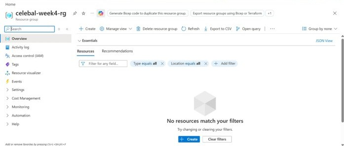
</p>

**✅ Outcome:** Resource Group successfully created and ready to host all Azure services.

---

### ✅ Task 2 — Storage Account & Blob Storage

Azure **Storage Account** provides scalable cloud storage. **Blob Storage** hosts the CSV source file.

| Step | Action |
|------|--------|
| 1 | Created a Storage Account |
| 2 | Configured basic storage settings |
| 3 | Created a Blob Container |
| 4 | Uploaded Superstore CSV dataset |

**📸 Screenshots:**

| Storage Account | Blob Container | Uploaded CSV |
|:---------------:|:--------------:|:------------:|
| 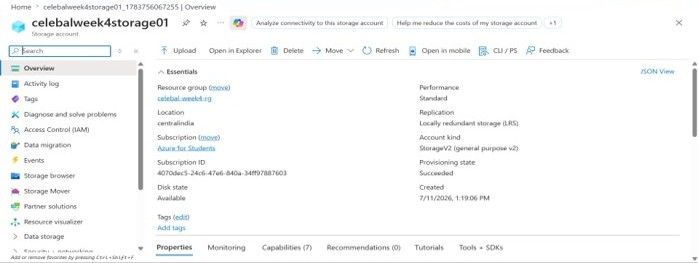 | 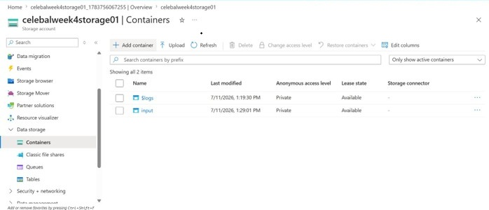 | 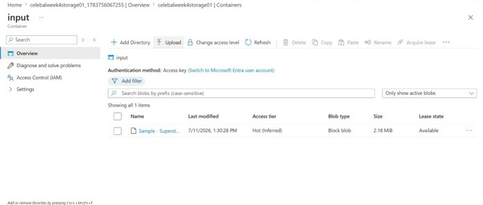 |

**✅ Outcome:** Dataset uploaded to Blob Storage and ready for pipeline processing.

---

### ✅ Task 3 — Azure Data Factory Configuration

**Azure Data Factory (ADF)** is the cloud-based ETL service used to build and orchestrate the data pipeline.

| Step | Action |
|------|--------|
| 1 | Created Azure Data Factory |
| 2 | Explored ADF interface (Author, Monitor, Manage) |
| 3 | Created **Linked Service** → Blob Storage |
| 4 | Created **Source Dataset** |
| 5 | Created **Destination Dataset** |
| 6 | Configured **Get Metadata** activity |

**📸 Screenshots:**

| ADF Overview | Linked Service (1) | Linked Service (2) |
|:------------:|:------------------:|:------------------:|
| 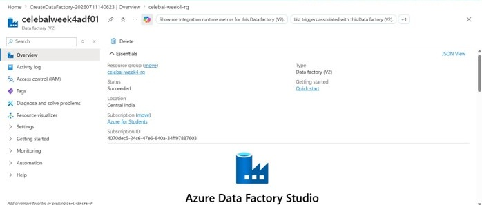 | 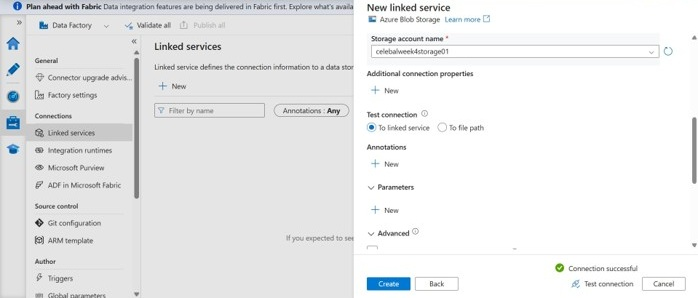 | 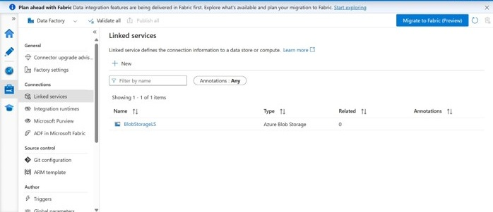 |

| Source Dataset | Destination Dataset | Get Metadata |
|:--------------:|:-------------------:|:------------:|
| 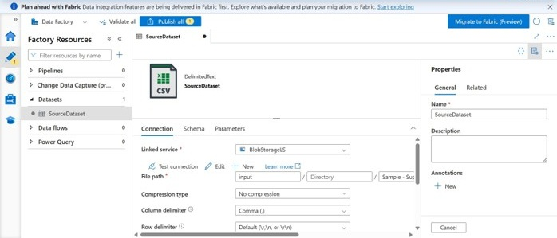 | 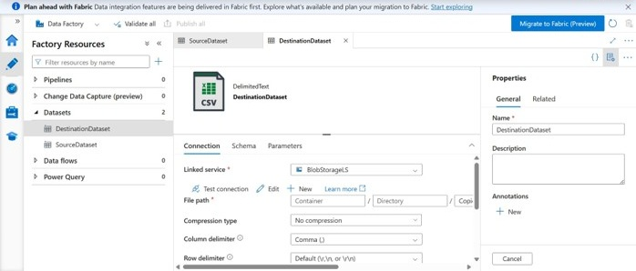 | 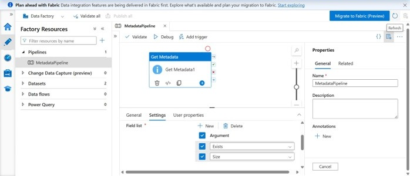 |

**✅ Outcome:** ADF configured and connected to Blob Storage via Linked Service.

---

### ✅ Task 4 — Pipeline Development

Developed an ETL pipeline using **Copy Data activity** to move data between storage locations.

| Step | Action |
|------|--------|
| 1 | Created a new pipeline |
| 2 | Added **Copy Data** activity |
| 3 | Configured **Source** dataset |
| 4 | Configured **Sink (Destination)** dataset |
| 5 | Configured copy settings & mapping |

**📸 Screenshots:**

| Pipeline Design | Source Config | Sink Config |
|:---------------:|:-------------:|:-----------:|
| 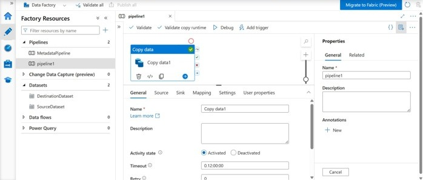 | 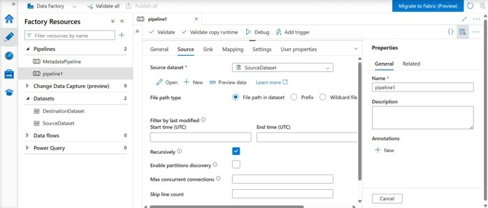 | 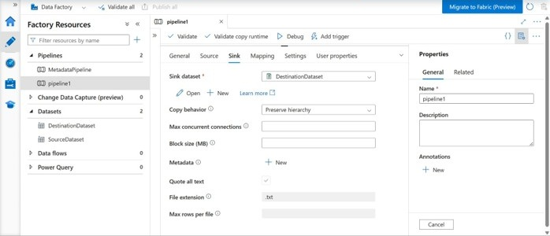 |

**✅ Outcome:** Pipeline designed with source → sink data movement.

---

### ✅ Task 5 — Pipeline Execution & Monitoring

Executed the pipeline and verified successful data movement.

| Step | Action |
|------|--------|
| 1 | Triggered pipeline via **Debug** |
| 2 | Monitored execution in **Monitor** tab |
| 3 | Verified **Succeeded** status |
| 4 | Confirmed output file at destination |

**📸 Screenshots:**

| Pipeline Execution | Output Verification |
|:------------------:|:-------------------:|
| 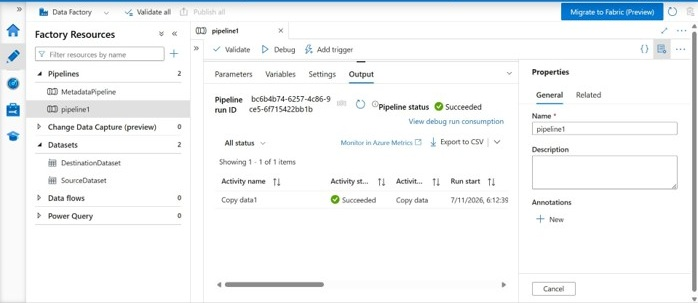 | 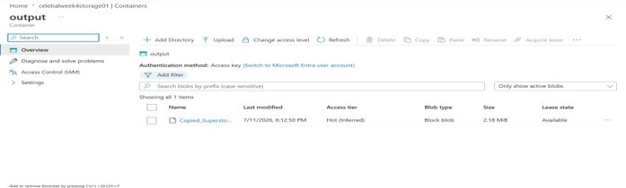 |

**✅ Outcome:** Pipeline executed successfully — data copied from source to destination container.

---

### ✅ Task 6 — Identity & Access Management (IAM)

Configured **Role-Based Access Control (RBAC)** to secure resource access.

| Role | Purpose |
|------|---------|
| **Reader** | View resources & monitor |
| **Contributor** | Create & manage resources |
| **ADF → Storage** | Grant ADF access to Blob Storage |

**📸 Screenshot:**
<p align="center">
  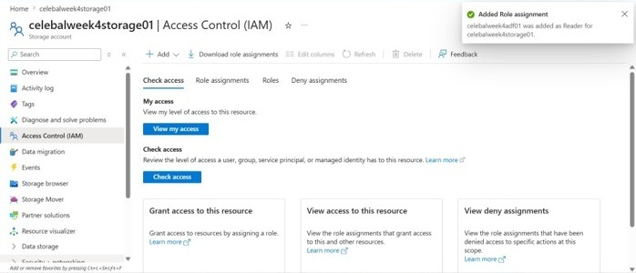
</p>

**✅ Outcome:** IAM roles assigned, enabling ADF to securely access Storage resources.

---

## 🧪 Mini Project — Customer Data Pipeline

### Problem Statement

> Build a cloud-based data pipeline that reads a CSV dataset from Azure Blob Storage, validates the file using **Get Metadata** activity, and copies the data to another Blob Storage location using **Azure Data Factory**.

### Implementation Stages

```
1. Upload CSV → Azure Blob Storage
2. Configure Linked Service
3. Create Source Dataset
4. Create Destination Dataset
5. Validate with Get Metadata
6. Execute Copy Data Pipeline
7. Verify Successful Execution
```

### Deliverables

| Check | Status |
|-------|--------|
| Pipeline executed successfully | ✅ |
| Metadata validated successfully | ✅ |
| CSV copied to destination Blob | ✅ |
| Execution monitored via ADF | ✅ |
| IAM roles configured | ✅ |

---

## 🧠 Dataset

The pipeline uses the **Sample-Superstore** dataset:

> **File:** `data/Sample-Superstore.csv`  

A fictional retail dataset containing sales, profit, quantity, and customer information across various product categories and regions.

---

## 📈 Key Learnings

| # | Learning Outcome |
|---|-----------------|
| 1 | Azure cloud fundamentals & resource management |
| 2 | Azure Storage Account & Blob Storage configuration |
| 3 | Building ETL pipelines with Azure Data Factory |
| 4 | Linked Services, Datasets & pipeline activities |
| 5 | Get Metadata & Copy Data activity usage |
| 6 | Pipeline execution & monitoring in ADF |
| 7 | Azure Role-Based Access Control (RBAC) |

---

## 🏁 Conclusion

This assignment provided **hands-on experience** with Microsoft Azure and Azure Data Factory by implementing a complete cloud-based ETL pipeline. From creating Azure resources to building, executing, and monitoring data pipelines, every step simulated a **real-world data engineering workflow**.

The integration of **Azure Storage**, **Azure Data Factory**, **Linked Services**, **Datasets**, and **IAM** demonstrates how modern cloud services can be combined to build **scalable**, **secure**, and **automated** data solutions.

---

<p align="center">
  <b>Celebal Technologies — Excellence Internship Program</b><br>
  Data Engineering · Week 4 · Azure Cloud Fundamentals & Data Pipeline
</p>
