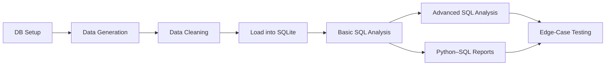

<div align="center">

<!-- ===== HERO / HEADER ===== -->

# 🛒 E-Commerce Order Analytics System

### *Week 08 · Celebal Technologies Excellence Internship Program*

|      |      |
| --- | --- |
| **Domain** | Data Engineering |
| **Author** | [Gaurav Kumar](#-author) |
| **Stack** | Python · Pandas · SQLite · SQL · Jupyter Notebook |

---

**A complete end-to-end data engineering pipeline that generates synthetic e-commerce data,
cleans & validates it, loads it into SQLite, and extracts business insights through
basic + advanced SQL analytics and Python-driven reporting.**

[📁 Project Structure](#-project-structure) ·
[🔁 Pipeline](#-pipeline-overview) ·
[📊 Insights](#-analytics--insights) ·
[🧪 Testing](#-edge-case-testing) ·
[🚀 Getting Started](#-getting-started)

</div>

---

## 📌 Project Overview

Real-world business data is rarely clean. This project simulates a realistic e-commerce
scenario where raw transactional datasets contain **intentional data quality issues**
(missing values, invalid date formats, negative quantities, malformed emails, and
inconsistent text). Each stage of the workflow mirrors industry-standard **data engineering**
and **business intelligence** practices:

1. 📦 **Generate** realistic synthetic data (with controlled defects)
2. 🧹 **Clean & validate** the raw data
3. 🗄️ **Load** into a SQLite relational database
4. 📈 **Analyze** with basic & advanced SQL
5. 🧾 **Report** via Python–SQL integration
6. 🧪 **Test** for edge cases & data quality

---

## ⚙️ Tech Stack & Tools

<p align="center">
  
  
  
  
</p>

---

## 📁 Project Structure

```
Week-08-ECommerce-Analytics/
│
├── 📒 DB-Setup.ipynb                        # Environment & database initialization
│
├── 📒 Section-A-Data-Generation.ipynb     # Synthetic data + intentional quality issues
├── 📒 Section-B-Data-Cleaning.ipynb       # Cleaning, normalization & validation
├── 📒 Section-C-SQL-Basic-Analysis.ipynb  # Basic SQL analytics
├── 📒 Section-D-SQL-Advanced-Analysis.ipynb # CTEs, window functions & ranking
├── 📒 Section-E-Python-SQL-Integration.ipynb # Business reports & dashboard
├── 📒 Section-F-Edge-Cases-Testing.ipynb  # Edge-case & data quality testing
│
├── 🗄️  ecommerce.db                     # SQLite relational database
│
├── 📂 data/
│   ├── 📂 raw-data/                     # Generated (defective) CSV files
│   └── 📂 cleaned-data/                 # Cleaned, analysis-ready CSV files
│
└── 📂 reports/
    └── issues_report.csv                # Data quality issues summary
```

---

## 🔁 Pipeline Overview



---

## 🗄️ Dataset Design

All datasets were generated with **500+ rows** using the `Faker` library and mirror a real
e-commerce catalogue — customers, products, orders, and order lines.

| Dataset | Rows | Columns | Notes |
|---|---|---|---|
| `customers.csv` | 500 | `customer_id`, `customer_name`, `email`, `registration_date`, `customer_type` | Types: `REGULAR`, `PREMIUM`, `VIP` |
| `products.csv` | 500 | `product_id`, `product_name`, `category`, `subcategory`, `cost_price` | Mixed-case names with extra spaces |
| `orders.csv` | 500 | `order_id`, `customer_id`, `order_date`, `status`, `region_code` | 5 statuses · 5% missing `customer_id` · DD-MM-YYYY dates |
| `order_items.csv` | 1500 | `item_id`, `order_id`, `product_id`, `quantity`, `unit_price`, `discount_percent` | ~3% negative quantities |

---

## 🧹 Data Quality Issues Handled

| Issue | Count |
|---|---|
| Missing customer IDs | **12** |
| Negative quantity rows | **48** |
| Invalid emails | **500** |
| Invalid order-item references | **0** |
| Invalid dates | **0** |

> ✨ The pipeline not only fixes these issues (date standardization, title-case product
> names, missing-ID handling) but also logs them to `reports/issues_report.csv`.

---

## 📈 Analytics & Insights

### Section-C · Basic SQL Analysis

| Query | Purpose |
|---|---|
| 💰 **Total Revenue per Category** | `SUM(quantity × unit_price)` grouped by `category` |
| 🏆 **Top 10 Customers** | Highest spenders via multi-table `JOIN` |
| 📅 **Monthly Order Count** | `strftime('%Y-%m')` time-series aggregation |
| 📦 **Orders by Status** | Distribution across all 5 order statuses |
| 🥇 **Top Selling Products** | Highest total quantity (limit 10) |
| 🌍 **Revenue by Region** | Regional `region_code` revenue contribution |

### Section-D · Advanced SQL Analysis

| Query | Technique |
|---|---|
| 🔄 **Running Revenue by Region** | Cumulative totals with **Window Functions** |
| 🏅 **Customer Revenue Ranking** | `DENSE_RANK()` / `ROW_NUMBER()` |
| 👑 **Top Customer per Region** | Highest spender in each region |
| 📊 **Monthly Revenue Growth** | `LAG()` for month-over-month comparison |
| 🧩 **Customer Segmentation** | `NTILE(4)` → 4 spending quartiles |
| 🗓️ **First & Last Purchase** | First/recent order per customer |

### Section-E · Python–SQL Integration

Combines Python + SQLite into an **executive dashboard-style report**:
`Total Revenue`, `Top 5 Customers`, `Best Selling Products`, `Revenue by Region` and
`Order Status Summary` — demonstrating Python as an automated reporting layer on top
of a relational database.

---

## 🧪 Edge-Case Testing

Seven validation tests verify pipeline robustness:

1. ❌ Orders with missing customer IDs
2. ❌ Invalid discount percentages (`> 100%`)
3. ❌ Zero or negative quantities
4. ❌ Future-dated orders
5. 🔗 Referential integrity (`order_items` → `orders`)
6. ✉️ Invalid email formats
7. 👥 Duplicate customer detection

---

## 🎯 Key Learnings

- **ETL pattern** with Python + pandas (`generate → clean → load`)
- Data cleaning: date normalization, string title-casing, missing-value handling
- **SQLite** connectivity + `to_sql()` bulk loading
- **Advanced SQL**: CTEs, window functions, `LAG()`, `RANK()`, `NTILE()`
- Python-as-reporting-layer for BI dashboards
- Data quality assurance & business-rule validation

---

## 🚀 Getting Started

**1. Prerequisites**

```bash
Python 3.10+   pandas   faker   sqlite3 (stdlib)
```

**2. Recommended run order**

```bash
# 1. Setup environment & database
jupyter notebook DB-Setup.ipynb

# 2. Generate raw datasets
jupyter notebook Section-A-Data-Generation.ipynb

# 3. Clean & validate
jupyter notebook Section-B-Data-Cleaning.ipynb

# 4.-7. Analyze & test
jupyter notebook Section-C-SQL-Basic-Analysis.ipynb
jupyter notebook Section-D-SQL-Advanced-Analysis.ipynb
jupyter notebook Section-E-Python-SQL-Integration.ipynb
jupyter notebook Section-F-Edge-Cases-Testing.ipynb
```

---

## 👤 Author

**Gaurav Kumar** · Data Engineering Internship · Celebal Technologies

<div align="center">

**Week 8 Completed** ✅ — End-to-End E-Commerce Analytics Pipeline

</div>